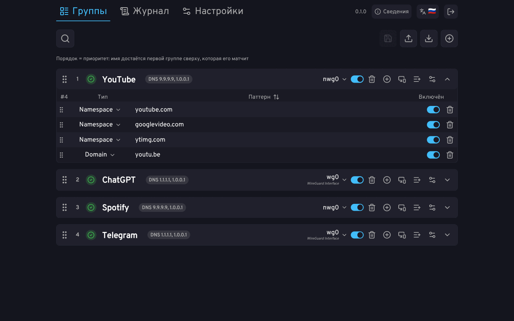

<p align="center">
  
</p>

<p align="center">
  <strong>Маршрутизация по доменам, а не по адресам.</strong>
  <br/>
  <sub>Entware / Keenetic · aarch64, mipsel, mips</sub>
</p>

<p align="center">
  <a href="#как-это-работает">Как это работает</a> ·
  <a href="#установка">Установка</a> ·
  <a href="#типы-правил">Типы правил</a> ·
  <a href="#производительность">Производительность</a> ·
  <a href="#ограничения">Ограничения</a> ·
  <a href="docs/swagger.yaml">HTTP API</a>
</p>

**firc** — утилита для точечной маршрутизации трафика по доменным именам на роутерах Keenetic: заворачивает нужные домены в нужный интерфейс (VPN, туннель, второй провайдер), не трогая остальной трафик. Ставится пакетом Entware поверх прошивки, работает через промежуточный DNS-прокси без отключения основного резолвера и настраивается из веб-интерфейса.

firc — продолжение форка [MagiTrickle](https://magitrickle.dev), переписанного [dan0102dan](https://github.com/dan0102dan) на C. Маршрутизация устроена принципиально иначе; общим с исходным проектом сейчас остаётся в основном дизайн веб-интерфейса.

<p align="center">
  
</p>

## Как это работает

Маршрутизация по адресам из DNS-ответа не умеет разделить два домена на одном адресе CDN: адрес у Cloudflare общий на тысячи сайтов, и в туннель уезжает либо лишнее, либо ничего.

firc перехватывает DNS-запросы клиентов. Домену, который подходит под правила группы, он **выдаёт собственный адрес** из приватного пула и отдаёт клиенту его вместо настоящего. Правило DNAT в ядре подменяет этот адрес обратно на настоящий, а метка пакета уводит соединение в интерфейс группы. Ключом маршрутизации становится домен, а не адрес CDN, за которым он живёт.

## Возможности

- **Маршрутизация по домену, а не по адресу.** Каждый домен из правил получает свой адрес из приватного пула, поэтому домены на общем адресе CDN не мешают друг другу.
- **Правила под задачу:** точный домен, домен с поддоменами, маски `*`/`?`, регулярные выражения, подсети IPv4 и IPv6. Для подсети можно указать протокол (TCP/UDP) и список портов: тогда в интерфейс уходит только этот трафик.
- **Списки правил в группе:** обычный текстовый список или правила в формате JSON (rule-set sing-box) по ссылке, с автообновлением по расписанию. Списки на сотни тысяч правил листаются и ищутся постранично.
- **DNS через интерфейс группы:** запросы на резолв доменов группы уходят через тот же интерфейс, через который маршрутизируется трафик этой группы. Так CDN отдаёт адреса для региона этого интерфейса.
- **Выбор устройств:** группа работает для всех устройств или только для выбранных — по политикам доступа Keenetic и по отдельным устройствам (MAC).
- **Журнал в веб-интерфейсе:** события демона, DNS-ответы с указанием выданного адреса и группы, захват трафика, который идёт мимо firc (обход через DoH или жёстко прописанный IP).
- **Настройки в веб-интерфейсе:** разделены на применяемые сразу и требующие перезапуска; перезапуск демона виден по шагам, а при ошибке объясняется, что пошло не так.
- **Fail-closed:** если интерфейс группы недоступен, её трафик не уходит мимо туннеля в открытую сеть.
- **Самовосстановление:** после того как прошивка перезаписывает таблицы netfilter, правила firc возвращаются примерно за 0,3 с; привязки доменов переживают перезапуск демона.

## Установка

Пакеты публикуются на странице [Releases](https://github.com/hoaxisr/firc/releases). Вариантов три — по архитектуре:

| Роутер | Пакет |
|---|---|
| Keenetic, aarch64 | `firc_<версия>-<ревизия>_entware_aarch64-3.10_kn.ipk` |
| Keenetic, mipsel | `firc_<версия>-<ревизия>_entware_mipsel-3.4_kn.ipk` |
| Keenetic, mips (big-endian) | `firc_<версия>-<ревизия>_entware_mips-3.4_kn.ipk` |

Все пакеты — сборки под Keenetic (`_kn`): разбор имён интерфейсов через RCI, хук `netfilter.d`, зависимость от `socat`.

```shell
opkg install ./firc_<версия>-<ревизия>_entware_<таргет>.ipk
/opt/etc/init.d/S99firc start
```

Обновление — тем же способом, с `restart` вместо `start`.

Нужен роутер Keenetic с Entware, aarch64, mipsel или mips. Памяти демону нужно немного: около 5 МБ без правил и около 21 МБ при 300 000 правил в списках; во время синхронизации большого списка — до 48 МБ (замеры ниже). OpenWrt не поддерживается. Сборка из исходников описана в [BUILDING.md](BUILDING.md).

## Типы правил

- **domain** — точный домен, без поддоменов: `sub.example.com` ловит только `sub.example.com`.
- **namespace** — домен и все его поддомены: `example.com` ловит `example.com`, `sub.example.com`, `a.sub.example.com`.
- **wildcard** — шаблон с `*` (любые символы) и `?` (ровно один символ): `*example.com` ловит и `example.com`, и `anotherexample.com`.
- **regex** — регулярное выражение [PCRE2](https://www.pcre.org/), для опытных: `^[a-z]*example\.com$`.
- **subnet** — подсеть IPv4 в нотации CIDR (`203.0.113.0/24`), по желанию только для заданного протокола и портов.
- **subnet6** — подсеть IPv6 в нотации CIDR (`2001:db8::/32`), с тем же уточнением по протоколу и портам.

## Производительность

| Метрика | Значение | Как мерили |
|---|---|---|
| RSS без правил | 5,2 МБ | VmRSS через 15 с после старта и одного DNS-запроса |
| RSS, 1 000 правил в списке | 5,4 МБ | `run_sub_cost.sh`, VmRSS после синхронизации списка |
| RSS, 100 000 правил | 11,9 МБ (пик 19,7 МБ во время синхронизации) | `run_sub_cost.sh`, VmRSS / VmHWM |
| RSS, 300 000 правил | 21,1 МБ (пик 48,0 МБ во время синхронизации) | `run_sub_cost.sh`, VmRSS / VmHWM |
| Синхронизация списка | 100 000 правил — 4,6 с; 300 000 — 14,8 с | `run_sub_cost.sh`: от POST синхронизации до события `done`, список отдаётся с самого роутера |
| DNS, домен без правил | p50 2,0 мс, p99 3,2 мс | `dnsload`, 1 клиент, 10 с, UDP, 1 000 имён, апстрим — `dnsstub` |
| DNS, домен под правилом, повторный запрос | p50 2,1 мс, p99 3,6 мс | то же, имя уже получило свой адрес; резолв группы через туннель выключен (по умолчанию к ответу добавляется задержка туннеля) |
| DNS, первый запрос нового домена под правилом | ≈0,26 с (p50 262 мс, p99 267 мс) | то же; ответ ждёт, пока в ядро запишется его правило DNAT |
| Пропускная способность DNS при p99 < 50 мс | ≈1 000 запросов/с (без правил 1 067 при p99 38 мс; под правилом 996 при p99 40 мс) | `dnsload`, перебор 1–100 параллельных клиентов, этот уровень при 20 |
| Восстановление правил netfilter после перезаписи таблицы прошивкой | медиана 0,31 с, максимум 0,33 с (20 повторов) | все правила firc удалены из `nat` одним `iptables-restore`, вызван хук `netfilter.d`; время до возврата всех правил; конфигурация с 5 правилами DNAT |
| Перезапуск до ответа API | медиана 2,67 с (5 повторов) | `S99firc restart`, опрос сокета API каждые 10 мс; включая остановку |

Keenetic KN-1810 (MT7621, 254 МБ ОЗУ), KeeneticOS 5.01.C.6.0-1, firc 0.1.0 (предрелизная сборка), 5 октября 2026; нагрузка, заглушка и демон на одном 2-ядерном CPU; aarch64 не мерили.

Повторить замеры: скрипты и генераторы нагрузки — в [tools/bench/](tools/bench/README.md).

## Ограничения

- `traceroute`/`tracert` до домена, который маршрутизирует firc, показывает выданный ему адрес на каждом хопе: NAT ядра переписывает и ICMP-ошибки, которые возвращаются с промежуточных узлов.
- Обратный запрос (PTR) к выданному адресу возвращает домен, которому этот адрес выдан.

Жёсткие лимиты демона (размер пула, число имён, групп) и что происходит при их достижении — в [docs/limits.md](docs/limits.md).

## Ссылки

- [BUILDING.md](BUILDING.md) — сборка из исходников
- [CONTRIBUTING.md](CONTRIBUTING.md) — как предложить изменения
- [docs/limits.md](docs/limits.md) — лимиты демона
- [docs/swagger.yaml](docs/swagger.yaml) — HTTP API
- [Баг-трекер](https://github.com/hoaxisr/firc/issues)

## Лицензия

GPL-3.0-or-later, см. [LICENSE](LICENSE).
